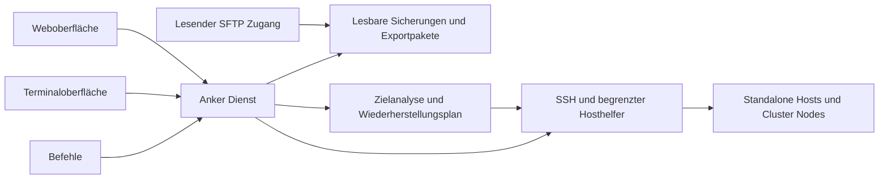

# Anker Konzept für Sicherung und Wiederherstellung von Proxmox Hosts

Stand: 5. Oktober 2026. Konzept zur fachlichen Prüfung, noch keine implementierte oder getestete Software.

Anker sichert die Konfiguration von rund 40 Proxmox-Hosts zentral und unterstützt die Wiederherstellung einzelner Dateien, eines ausgefallenen Hosts und die Migration auf andere Hardware oder eine andere Proxmox-Version. Die Umgebung umfasst einen Cluster mit sieben Nodes und weitere Standalone-Hosts. Der zentrale Server erreicht die Hosts über LAN und VPN. VM- und Container-Daten werden bereits mit Proxmox Backup Server gesichert.

Der entscheidende Grundsatz lautet: Jede Originalsicherung bleibt unverändert. Anker untersucht das Wiederherstellungsziel und erzeugt daraus einen separaten Plan mit angepassten Dateien, Voraussetzungen und Prüfungen. Ein vollständiger Export bleibt ohne laufendes Anker verständlich und manuell nutzbar.

## Ziele und Umfang

Anker bietet eine moderne, reduzierte Weboberfläche, eine interaktive Terminaloberfläche mit Tastatur- und Mausbedienung sowie kurze Befehle. Alle drei verwenden dieselben Berechtigungen und Abläufe. Mausunterstützung ergänzt die vollständige Tastaturbedienung, soweit das verwendete Terminal sie unterstützt.

Der Funktionsumfang umfasst Hosts und Cluster, Sicherungsprofile, Zeitpläne, Sicherungshistorie, Dateiansicht, Unterschiede zwischen Ständen, Downloads, SFTP-Zugriff, Archivierung, Integritätsprüfung und geführte Wiederherstellung. Migrationen berücksichtigen Hardware, Hostidentität, Betriebssystem und Proxmox-Version. Geheimnisse gehören zur Sicherung.

Anker ist eine Sicherung der Konfiguration und des für den Wiederaufbau nötigen Inventars. Eine frische Proxmox-Installation und verfügbare VM-Daten sind Voraussetzungen eines vollständigen Wiederaufbaus. Das Inventar ersetzt keine Datenträgerinhalte. Eine automatische Proxmox-Installation, Firmware-Konfiguration und universelle Datenträgerrekonstruktion gehören nicht zum Grundumfang. Anker dokumentiert diese Voraussetzungen im Wiederherstellungsplan. Eine zusätzliche Kopie auf einem weiteren Speicher wird entsprechend dem Nutzerwunsch nicht eingerichtet.

## Gewählter Ansatz

| Ansatz | Nutzen | Grenze |
| --- | --- | --- |
| Dateien kopieren und unverändert zurückschreiben | Wenig Komponenten und einfach lesbare Dateien | Hardwareabhängigkeiten und Versionsunterschiede bleiben ungelöst |
| Komplettes Systemabbild | Kann einen identischen Ausgangszustand abbilden | Größerer Speicherbedarf und eigener Aufwand für andere Hardware; einzelne Configs sind weniger bequem zugänglich |
| Lesbare Sicherungen und Wiederherstellung anhand geprüfter Regeln | Direkter Dateizugriff und nachvollziehbare Anpassung an ein neues Ziel | Benötigt Regeln, Zielinventar und Wiederherstellungstests |

Anker verwendet den dritten Ansatz. Die intelligente Unterstützung besteht aus nachvollziehbaren Prüfungen und Zuordnungen. Ein Sprachmodell ist für Sicherung oder Wiederherstellung nicht erforderlich. Unbekannte Konfigurationen werden erhalten und als manuell zu bearbeiten ausgewiesen.

## Aufbau der Anwendung

Ein zentraler Dienst verwaltet Hosts, Aufträge, Zeitpläne und Wiederherstellungspläne. Seine Komponenten haben klar abgegrenzte Aufgaben: Erfassung und Transfer, Ablage und Integrität, Planung und Anpassung sowie schrittweise Ausführung und Prüfung. Die Oberflächen enthalten keine eigene Wiederherstellungslogik.



Als technischer Vorschlag dient ein einzelnes Linux-Programm in Go mit integriertem Webfrontend, lokalem SQLite-Katalog und Betrieb über systemd auf einer zentralen Debian-VM. Diese Wahl soll Installation und Updates überschaubar halten. Konkrete Bibliotheken und die unterstützten Debian-Versionen werden im Implementierungsplan festgelegt.

Die Sicherungen sind die dauerhafte Grundlage. Der Katalog erleichtert Suche und Auftragssteuerung und kann aus veröffentlichten Manifesten rekonstruiert werden. Die Anker-Betriebskonfiguration bleibt separat exportierbar. Auf den Proxmox-Hosts läuft kein zusätzlicher dauerhafter Dienst; ein kleiner, versionierter Helfer übernimmt begrenzte privilegierte Leseoperationen und ausdrücklich gestartete Wiederherstellungsschritte über SSH.

## Hostidentität und Einrichtung

Jeder Host erhält eine unveränderliche Anker-ID. Hostname und IP sind veränderliche Eigenschaften. Cluster erhalten eigene IDs. Eine Neuinstallation oder neue Hardware wird nicht aufgrund einer gleichen IP automatisch als derselbe Host akzeptiert.

Die Einrichtung erfasst Adresse, SSH-Port, verifizierten Hostschlüssel, Zugangsprofil, Standort, erwartete Clusterzugehörigkeit und Sicherungsprofil. Ein Prüflauf zeigt Proxmox-Version, erforderliche Leserechte, verfügbare Werkzeuge und fehlende Bestandteile. Änderungen am SSH-Hostschlüssel sperren den automatischen Zugriff bis zur erneuten Identitätsprüfung.

Passwortlose Automationen verwenden eigene SSH-Schlüssel. Zertifikate sind optional, falls später eine vorhandene SSH-Zertifizierungsstelle eingebunden wird. [OpenSSH beschreibt beide Authentifizierungsverfahren](https://man.openbsd.org/ssh.1).

## Inhalt einer Host Sicherung

Das Standardprofil erfasst das vollständige erreichbare `/etc` einschließlich Proxmox-, Netzwerk-, Storage-, Firewall-, Benutzer-, SSH-, Zertifikats- und Dienstkonfiguration. Für `/etc/pve` gelten die besonderen Regeln des folgenden Abschnitts. Zugriffsfehler werden nicht stillschweigend übersprungen.

Zusätzlich werden die Proxmox-Konfigurationsdatenbank sowie erkannte und explizit freigegebene Anpassungen außerhalb von `/etc` erfasst, beispielsweise administrative Skripte unter `/usr/local`, relevante eigene systemd-Dateien und ausgewählte Dateien aus `/root/.ssh`. Ein Verzeichnis wie `/root` oder `/var/lib` wird nicht pauschal kopiert. Lokale Storage-Snippets, Hooks, externe Secret-Dateien und referenzierte eigene Skripte werden als Abhängigkeiten gesucht und in das Profil aufgenommen oder als fehlend ausgewiesen. Zielpfade symbolischer Links außerhalb des Profils werden dokumentiert und auf Relevanz geprüft.

Das Inventar enthält:

- Proxmox-, Debian-, Kernel- und Paketversionen, Paketquellen und manuell installierte Pakete.
- Hostname, IPs, Routing, DNS, Bridges, Bonds, VLANs und Firewallbezüge.
- Physische Schnittstellen mit MAC-Adresse, PCI-Pfad, Treiber und verfügbaren Linkinformationen.
- Datenträger mit stabilen Kennungen, Größen, Partitionen, UUIDs, Mounts, LVM- und ZFS-Struktur sowie Proxmox-Storage-Definitionen.
- Bootmodus, Bootloader, relevante Module, IOMMU, PCI-Passthrough und erkannte Treiberanforderungen.
- Clusteridentität, Nodezugehörigkeit, Quorumbeobachtung, HA- und gegebenenfalls Ceph-Bezüge zum Erfassungszeitpunkt.
- Dienste, eigene Anpassungen und Abhängigkeiten, Sicherungsprofil und tatsächliche Ausschlüsse.

VM- und Container-Konfigurationen können als Teil von `/etc/pve` enthalten sein. Ihre Wiederherstellung wird mit vorhandenen Gästen und der Wiederherstellung aus PBS abgestimmt, damit keine widersprüchlichen Definitionen entstehen. Gastdaten, ISO-Dateien, Templates und Storage-Inhalte werden nicht automatisch mitgesichert. Referenzierte, aber extern gesicherte Inhalte erscheinen mit ihrer Herkunft in der Anleitung.

## Konsistenz der Sicherung

`/etc/pve` ist das von pmxcfs bereitgestellte, datenbankgestützte Proxmox-Konfigurationsdateisystem. Anker muss sowohl eine lesbare Ansicht als auch eine konsistente Kopie von `/var/lib/pve-cluster/config.db` liefern. Die Datenbank hat außerdem einen eigenen Wiederherstellungsweg. [Proxmox dokumentiert pmxcfs und die Datenbank-Recovery](https://github.com/proxmox/pve-docs/blob/master/pmxcfs.adoc).

Für die laufende Datenbank ist die SQLite Online Backup API der vorgesehene Ansatz. Sie erstellt einen konsistenten Datenbankstand; die Eignung für jede unterstützte pmxcfs-Version ist vor Produktfreigabe im Labor zu verifizieren. Die Datenbank wird weder während des Betriebs unkoordiniert kopiert noch vom Sicherungsvorgang verändert. [SQLite erläutert Konsistenz und mögliche Konflikte bei Online-Sicherungen](https://www.sqlite.org/backup.html).

Die lesbare Ansicht wird aus dem gesicherten Datenbankstand über einen versionsgeprüften Decoder abgeleitet und mit dem erfassten pmxcfs-Inventar abgeglichen. Dynamische Statusdateien und virtuelle Alias-Pfade werden gesondert gekennzeichnet; sie sind keine unabhängig zurückzuschreibenden Configs. Eine nicht unterstützte Datenbankstruktur verhindert die Einstufung als vollständige, geprüfte Sicherung.

Dateien außerhalb von pmxcfs werden mit Metadaten vor und nach dem Lesen auf Änderungen geprüft und bei Veränderungen erneut erfasst. Zusammengehörige Konfigurationsgruppen erhalten zusätzliche Konsistenzprüfungen. Ein laufender Host bietet dadurch keinen garantierten globalen Zeitpunkt über alle Dateien, Dienste und die Datenbank hinweg. Das Manifest dokumentiert Erfassungszeitraum und Konsistenzstatus. Für migrationskritische Stände sieht Anker eine abschließende Sicherung im vereinbarten Änderungsstopp vor.

Ein normaler Sicherungslauf stoppt keine Cluster- oder Gastdienste. Bei nicht sicher erfassbaren Bestandteilen meldet er einen Fehler oder eingeschränkte Vollständigkeit. Er erzwingt keinen riskanten Ausweichweg.

## Dateisystem und Export

Der vorgeschlagene Datenpfad ist `/srv/anker`. Hostnamen sind beschreibende Metadaten; stabile IDs halten die Ablage bei Umbenennungen eindeutig. Zeitpunkte werden intern in UTC mit Kollisionsschutz gespeichert und in den Oberflächen in der eingestellten Zeitzone angezeigt.

```text
/srv/anker/
  hosts/<host-id>/backups/<zeitpunkt-und-id>/
    files/etc/...
    files/usr/local/...
    recovery/config.db
    inventory/host.json
    inventory/network.json
    inventory/storage.json
    inventory/software.json
    inventory/cluster.json
    manifest.json
    checksums.sha256
    WIEDERHERSTELLUNG.md
  clusters/<cluster-id>/
    index.json
  plans/<plan-id>/
    source.json
    target.json
    mapping.yaml
    plan.json
    changes.diff
    prepared-files/...
    WIEDERHERSTELLUNG.md
  exports/<export-id>/...
  staging/<job-id>/...
```

Der Clusterindex referenziert zusammengehörige Hoststände und deren Erfassungszeiten. Er behauptet keine atomare Sicherung aller Nodes. Bei vollständiger Cluster-Recovery muss ein geeigneter gemeinsamer Zustand gewählt werden.

Das versionierte Manifest führt jede Datei mit relativem Pfad, Typ, Prüfsumme, Größe, Zeitstempeln, originaler numerischer UID/GID, Namenszuordnung, Modus, Symlinkziel und verfügbaren ACLs beziehungsweise erweiterten Attributen auf. Das Sicherungsprofil, Quellen, Werkzeugversionen und Fehler sind enthalten. Nicht erfassbare Metadaten werden als Lücke ausgewiesen. Die Originalrechte werden im Manifest erhalten; die Ablage erhält eigene restriktive Rechte, damit ursprünglich öffentlich lesbare Dateien keine Sicherungsgeheimnisse offenlegen.

Jeder Sicherungsstand enthält eine Anleitung für die manuelle Wiederherstellung einschließlich Voraussetzungen, Metadatenwiederherstellung, Grenzen und Reihenfolge. Ohne Zielanalyse beschreibt sie den Quellzustand und Entscheidungen, die am Ziel nötig sind. Ein vorbereitetes Migrationspaket enthält zusätzlich Zielinventar, bestätigte Zuordnungen, konkrete Änderungen und Prüfschritte. Es benötigt weder Anker-Katalog noch Internetzugriff. Original und vorbereitete Dateien bleiben deutlich getrennt.

Lesender SFTP-Zugriff bietet Originalstände und bereits erzeugte Exportpakete an. Er löst keine Wiederherstellung aus. Weil einfache SFTP-Downloads nicht zuverlässig alle Linux-Metadaten übernehmen, gibt es zusätzlich ein portables tar-Archiv mit Metadaten und Prüfsummen. Ein Export ist erst vollständig, wenn Dateien, Manifest, Anleitung und erforderliche Datenbank vorhanden und geprüft sind. Extraktion und Wiederherstellung prüfen Pfade und Symlinks gegen unbeabsichtigte Schreibzugriffe außerhalb des gewählten Ziels. Originale Symlinks werden im Manifest und im Archiv erhalten. In der durchsuchbaren Ablage werden sie als inerte Einträge dargestellt, damit sie weder Dateien des Anker-Servers öffnen noch außerhalb eines Sicherungsstands dereferenziert werden. Anleitung und Export dokumentieren diese Darstellung und deren Rückübersetzung.

## Ablauf einer Sicherung

Ein Auftrag reserviert den Host, prüft Identität und Erreichbarkeit, erfasst Dateien und Inventar in einem temporären Bereich, prüft Datenbank und Prüfsummen und veröffentlicht den Stand erst danach atomar. Die Sperre verhindert gleichzeitig laufende Sicherung und Wiederherstellung desselben Hosts. Clusterweite Wiederherstellungen brauchen zusätzlich eine Clustersperre.

Die Zustände lauten geplant, läuft, wird geprüft, erfolgreich, eingeschränkt, fehlgeschlagen oder abgebrochen. Ein eingeschränkter Stand bleibt für manuelle Rettung verfügbar, zählt aber nicht als letzter erfolgreicher Pflichtstand. Ein Absturz hinterlässt keinen scheinbar vollständigen Stand. Wiederholungen bekommen eigene Auftrags-IDs; ein Neustart rekonstruiert den letzten bekannten Zustand.

## Wiederherstellungsplan

Ein Plan ist ein dauerhaftes, versioniertes Dokument. Er bindet die genaue Sicherung, deren Prüfsummen, das geprüfte Ziel, die Anker-Regelversion, Zuordnungen, Voraussetzungen, Dateidiffs und Schritte. Die Oberfläche zeigt je Bestandteil unverändert übernehmen, anpassen, neu erzeugen, manuell bearbeiten oder blockiert.

Die Planung trennt Erkennen, Entscheiden und Ausführen:

1. Sicherung auf Vollständigkeit, Integrität und unterstützte Formate prüfen.
2. Zielinventar, laufende Gäste, vorhandenen Storage und Clusterzustand erfassen.
3. Szenario und Zielidentität wählen; Unterschiede und externe Voraussetzungen anzeigen.
4. Hardware- und Versionszuordnungen festlegen; unbekannte Punkte einzeln auflösen.
5. Vorbereitete Dateien und Reihenfolge erzeugen; Geheimnisse standardmäßig verdecken.
6. Plan prüfen und dessen konkrete Ausführung freigeben.
7. Zielzustand unmittelbar erneut prüfen und vorherige Zielkonfiguration sichern.
8. Schritte ausführen, nach jedem kritischen Abschnitt prüfen und Ergebnis exportieren.

Hat sich das Ziel wesentlich geändert, wird der Plan ungültig und muss neu geprüft werden. Dazu zählen geänderte Prüfsummen betroffener Dateien, Versionen, Port- und Datenträgeridentitäten, vorhandene Gäste sowie Clusterzugehörigkeit und Quorumzustand. CLI, Terminal und Web verlangen dieselbe konkrete Freigabe. Eine unbeaufsichtigte Wiederherstellung ist kein Standard. Ein pauschales Force-Flag darf Identitäts-, Quorum-, Datenträger- oder Integritätsprüfungen nicht umgehen.

## Anpassung an andere Hardware

| Bereich | Zuordnung und Prüfung | Verhalten bei Unklarheit |
| --- | --- | --- |
| Netzwerk | Management-, Storage- und Clusterrollen auf neue Ports abbilden; Bridges, Bonds, VLANs und Routen prüfen | Auswahl verlangen; Erreichbarkeit und Konsolenzugang klären |
| Storage | Storage-ID auf vorhandenen Zielpool, Volume Group, Mount oder entfernten Storage abbilden | Voraussetzungen dokumentieren; kein stilles Anlegen oder Formatieren |
| Boot | BIOS/UEFI, neue UUIDs, Root-Dateisystem und Bootloader berücksichtigen | Zielinstallation erhalten; notwendige Rekonstruktion gesondert führen |
| Geräte | PCI-Adressen, Passthrough, IOMMU, Treiber und Schnittstellen prüfen | Betroffene Konfiguration für manuelle Bearbeitung sperren |
| Identität | Hostname, IP, Nodeidentität, SSH-Hostschlüssel und Zertifikate getrennt entscheiden | Kollision verhindern; neues Ziel nicht automatisch impersonieren |

Netzwerknamen können sich durch Hardware-, Kernel- oder Treiberänderungen unterscheiden. Die gesicherte Rolle eines Ports ist deshalb wichtiger als sein Name. MAC-Adresse oder PCI-Pfad sind Hinweise, beweisen aber bei neuer Hardware keine funktionale Zuordnung. [Proxmox erläutert die Benennung von Schnittstellen](https://pve.proxmox.com/wiki/Network_Configuration).

Ein Poolwechsel, etwa von ZFS zu LVM, bedeutet keine einfache Übersetzung der Datenbank. Anker bildet die gewünschte Storage-Anbindung ab und prüft, ob die Zielstruktur bereits eingerichtet wurde. Datenträgerformatierung, Poolerstellung und Datenmigration sind eigene, ausdrücklich zu bestätigende Vorgänge außerhalb der normalen Config-Wiederherstellung.

Benutzerkonten, `/etc/passwd`, `/etc/shadow`, Paketquellen, `fstab`, Boot- und Hardwarekonfiguration werden bei Neuinstallation nicht pauschal überschrieben. Stattdessen entscheidet das Szenarioprofil über gezielte Übernahme oder Anpassung. Nicht zuordenbare UID/GID-Werte blockieren betroffene automatische Schreibschritte. Proxmox-Zugangs- und Storage-Secrets werden gezielt übernommen; maschinenspezifische Identitäten werden je Szenario erhalten oder neu erzeugt.

## Wiederherstellungsszenarien

| Szenario | Vorgesehener Ablauf |
| --- | --- |
| Einzelne Datei auf vorhandenem Host | Aktuellen Stand sichern, Diff und Metadaten prüfen, Datei gezielt übernehmen, abhängige Dienste validieren |
| Konfigurationsgruppe auf vorhandenem Host | Zusammengehörige Dateien planen und in definierter Reihenfolge anwenden; Netzwerk und Cluster separat behandeln |
| Standalone nach Totalausfall | Proxmox frisch installieren, Ziel inventarisieren, Identität und Hardware zuordnen, Hostkonfiguration herstellen, anschließend PBS-Gäste beziehungsweise vorhandene Daten anbinden |
| Geplante Migration auf andere Hardware | Ziel parallel vorbereiten, finale Quellsicherung im Änderungsstopp erstellen, alten Host kontrolliert außer Betrieb nehmen und erst dann kollidierende Identität aktivieren |
| Ersatznode in gesundem Cluster | Lebenden Cluster als Quelle des gemeinsamen Zustands verwenden; lokale Hardwarekonfiguration vorbereiten; Entfernung und Wiederbeitritt des ausgefallenen Nodes anhand des Clusterplans führen |
| Vollständiger Clusterverlust | Nodes und gemeinsame Konfiguration aus geeignetem Stand in isolierter Umgebung rekonstruieren; Clusteridentität, Quorum, Storage und HA vor Freigabe validieren |
| Neue Proxmox-Hauptversion | Frische Zielinstallation oder gesonderten Upgradepfad verwenden; nur geprüfte Konfigurationsregeln übernehmen |
| Wechsel zwischen Standalone und Cluster | Expliziten Topologiewechsel planen; gemeinsame Konfiguration und Nodeidentität neu bewerten |
| Manuelle Rettung ohne Anker | Originalpaket prüfen, Anleitung und Inventar verwenden, erforderliche Zuordnungen dokumentieren und Dateien gezielt übernehmen |

Beim Beitritt zu einem Cluster wird die vorhandene Konfiguration unter `/etc/pve` überschrieben und die Storage-Konfiguration des Clusters übernommen. Deshalb kommt der Beitritt in einem eigenen, versionsabhängigen Ablauf vor; alte Gäste- oder Clusterdefinitionen werden nicht vorher pauschal eingespielt. [Proxmox beschreibt den Clusterbeitritt](https://github.com/proxmox/pve-docs/blob/master/pvecm.adoc).

Die gesamte gesicherte `config.db` darf nur in einem eigens geprüften Recovery-Szenario eingesetzt werden. Ein Datenbanktausch in einem laufenden gesunden Cluster ist kein allgemeiner Weg zur Node-Migration. Anker erzwingt kein Quorum und startet keine HA-Gäste automatisch während der Wiederherstellung. Ein noch aktiver alter Node muss verlässlich ausgeschaltet oder isoliert sein, bevor seine Identität übernommen wird.

Ceph-Konfiguration, Zugangsdaten und Topologieinformationen werden bei vorhandener Ceph-Nutzung erfasst. Die Wiederherstellung verlorener Ceph-Daten oder eines vollständigen Ceph-Clusters benötigt einen eigenen Daten- und Recoveryplan. Anker zeigt diese Abhängigkeit vor der Ausführung; die Host-Konfigurationssicherung allein gilt nicht als vollständige Ceph-Recovery.

## Versionswechsel und Kompatibilität

Anker erkennt Quell- und Zielversion einschließlich Debian-Basis, Proxmox-Paketen und Datenbankformat. Seine Regeln nennen konkrete getestete Kombinationen und Voraussetzungen. Als erste Prüffamilien sind Proxmox VE 8 und 9 vorgesehen; die tatsächlich eingesetzten Versionen werden über den Hostimport ermittelt. Ältere und zukünftige Versionen können inventarisiert und exportiert werden, erhalten aber ohne nachgewiesene Regeln keine automatische Wiederherstellungsfreigabe.

Die Unterstützung wird je Szenario ausgewiesen: erfassbar, Integrität geprüft, automatisch wiederherstellbar oder manuell zu bearbeiten. Ein Sicherungserfolg beweist keine Versionskompatibilität. Anker behauptet keine Unterstützung für beliebige Hauptversionssprünge oder Downgrades.

Eine Migration auf eine frisch installierte neuere Version und ein Upgrade des laufenden Betriebssystems sind getrennte Abläufe. Ein In-place-Upgrade setzt den passenden offiziellen Proxmox-Pfad und dessen Vorprüfungen voraus. Die zugehörigen Anleitungen werden bei Einführung des jeweiligen Versionsadapters geprüft und mit Prüfdatum und Voraussetzungen hinterlegt. Repository-Änderungen, Paket-Upgrades und Reboots laufen nicht als unbezeichnete Nebenwirkung einer Config-Restore.

Für unbekannte Formate werden Originaldateien und Inventar bereitgestellt, betroffene automatische Schritte jedoch blockiert. Eigene Pakete und Hooks erhalten einen Kompatibilitätsstatus. Nicht verfügbare Pakete werden ausgewiesen, statt ihre alte Konfiguration ungeprüft zu aktivieren.

## Ausführung und Rückweg

Schritte werden dauerhaft protokolliert und vor einer Wiederholung am tatsächlichen Ziel geprüft. Nach einem Verbindungsverlust bedeutet ein fehlender Erfolgsbericht nicht, dass der Remote-Schritt nicht ausgeführt wurde. Anker fragt den Zustand erneut ab; es wiederholt keinen unbekannten destruktiven Schritt automatisch.

Normale Dateiersetzungen nutzen temporäre Dateien und atomare Umbenennung, soweit das Zieldateisystem diese unterstützt. pmxcfs erhält eigene Schreibregeln entsprechend seiner besonderen Semantik. Ein vorheriger Zielstand, Wiederherstellungsschritte und Prüfergebnisse bleiben abrufbar.

Netzwerkänderungen benötigen nachgewiesenen Konsolenzugang über beispielsweise IPMI/iKVM oder lokale Anwesenheit. Wo technisch geprüft, setzt ein lokaler Wächter die vorherige Netzwerkkonfiguration zurück, wenn eine rechtzeitige Bestätigung ausbleibt. Bootfehler, ausgefallene Hardware, Clusterbeitritt und Datenträgeränderungen sind damit nicht vollständig rückrollbar. Für sie nennt der Plan einen gesonderten Rückweg und Haltepunkte.

Ein Auftrag meldet wiederhergestellt erst nach erfolgreichen Prüfungen. Er unterscheidet Dateien übertragen, Konfiguration angewendet, Dienste geprüft und Neustart geprüft. Ohne erforderlichen Neustartnachweis bleibt die entsprechende Prüfung ausstehend. Der Nachweis erfolgt über erneutes Bootinventar und Erreichbarkeit; kritische Netzwerk-, Storage- und Clusterprüfungen werden wiederholt.

## Zugriff und Schutz sensibler Daten

Der Anker-Dienst läuft zentral unter einem eigenen Benutzer. Seine SSH-Schlüssel bleiben außerhalb der SFTP-Ablage. Hostzugriffe werden nach Möglichkeit pro Host getrennt und auf die Quelladresse des Anker-Servers sowie den erforderlichen Helfer beschränkt. Der Backupzugang erlaubt keine allgemeine Root-Shell. Der privilegierte Helfer akzeptiert feste Operationen, geprüfte Pfade und keine frei zusammengesetzten Shellbefehle.

Für Änderungen am Ziel wird ein gesondert autorisierter Wiederherstellungszugang verwendet, der nur für den konkreten Vorgang eingerichtet oder freigegeben wird. Ein reiner Backupzugang wird nicht stillschweigend zu einem Schreibzugang erweitert.

Die Weboberfläche ist für LAN/VPN mit HTTPS und Anmeldung vorgesehen. Es gibt einen initialen Administrator ohne Standardpasswort und die Rollen Administration, Wiederherstellung und Lesen. Lesen bedeutet Zugriff auf Inventar und Status; Zugriff auf unmaskierte Secrets oder vollständige Exporte ist eine zusätzliche Berechtigung. Lokale CLI-Aufrufe authentifizieren sich am Unix-Socket über den lokalen Benutzer. Alle Oberflächen verwenden die gleiche Autorisierung.

SFTP bietet nur berechtigte Sicherungen und Exportpakete lesend in einer isolierten Verzeichniswurzel an; Betriebskonfiguration und Zugangsschlüssel werden nicht angeboten. Diff- und Vorschauansichten maskieren bekannte Secrets; Secret-Dateien sind standardmäßig vollständig verdeckt, da eine Mustererkennung nicht alle Geheimnisse identifizieren kann. Vollständige Originaldateien sind für berechtigte Nutzer bewusst abrufbar. Downloads und Wiederherstellungen werden mit Benutzer, Zeitpunkt und Gegenstand protokolliert, ohne Secret-Inhalte aufzuzeichnen.

Die Ablage wird standardmäßig als geschütztes Dateisystem betrieben. Verschlüsselung des zentralen Datenträgers wird empfohlen und vom Betriebssystem verwaltet; im laufenden entsperrten System bleiben die Dateien für autorisierte Zugriffe lesbar. Der Entsperrweg muss zum zentralen Serverbetrieb passen und außerhalb des Backup-Verzeichnisses dokumentiert sein. Es gibt kein proprietäres Anker-Dateiformat und keine obligatorische zusätzliche Dateiverschlüsselung, die SFTP-Zugriff erschwert. Zugriffsrechte oder Datenträgerverschlüsselung schützen nicht gegen einen vollständig kompromittierten laufenden Anker-Server.

## Zeitpläne Aufbewahrung und Fehler

Vorgeschlagene, pro Host oder Gruppe änderbare Startwerte sind eine tägliche Sicherung um 02:00 Uhr Europe/Berlin mit über 60 Minuten verteilten Startzeiten, vier gleichzeitigen Sicherungen, drei Wiederholungen bei vorübergehenden Verbindungsfehlern und einer Warnung nach 26 Stunden ohne erfolgreichen Stand. Bei Sommerzeitwechsel wird ein Tageslauf höchstens einmal geplant; übersprungene lokale Startzeiten werden nach dem Uhrsprung nachgeholt. Verpasste Läufe werden nach Dienststart kontrolliert nachgeholt.

Als Vorschlag werden 30 Tagesstände, 12 Wochenstände und 12 Monatsstände erhalten. Ein Stand kann mehrere Kriterien erfüllen und wird dann nur einmal gespeichert. Markierte Stände und von aktiven Wiederherstellungsplänen referenzierte Stände sind geschützt. Der letzte erfolgreiche Stand wird nie automatisch gelöscht. Die Werte sind Betriebsvorschläge, keine vom Nutzer bereits festgelegten Anforderungen.

Die erste Ausbaustufe verwendet vollständige lesbare Verzeichnisstände ohne gemeinsam beschreibbare Hardlinks. So kann eine Änderung nicht mehrere Stände beschädigen. Nach Speicherbedarf kann Anker ältere Stände ab 90 Tagen in tar.zst archivieren. Vor dem Entfernen des Verzeichnisses prüft es Archivinhalt, Metadaten und Prüfsummen. SFTP zeigt Archive sichtbar an; aktive beziehungsweise exportierte Stände bleiben als Ordner verfügbar. Dekompression und Archivierung sind ebenfalls atomare Aufträge.

Speicherauslastung wird ab 80 Prozent gewarnt; ab 90 Prozent werden nicht erforderliche Exporte und Archivierungsarbeiten zurückgestellt. Jeder neue Auftrag prüft zusätzlich den benötigten freien Platz. Platzmangel rechtfertigt keine ungeplante Löschung. Offline-Hosts behalten ihre bisherigen Sicherungen. Ein entferntes Hostprofil löscht keine Backups automatisch.

Fehler erscheinen unmittelbar in allen Oberflächen. Anker unterstützt eine zentrale SMTP- oder Webhook-Anbindung für Fehlermeldungen, überfällige Sicherungen und erneuten Erfolg nach einem Fehler. Ohne eingerichteten Kanal bleibt deutlich sichtbar, dass keine externe Benachrichtigung erfolgt. Tägliche unveränderte Erfolge erzeugen standardmäßig keine Meldung.

## Bedienung und Darstellung

Die Hauptansicht zeigt Hosts, letzten erfolgreichen Stand, Alter, Erreichbarkeit und offene Probleme. Cluster werden als Gruppe dargestellt, bleiben aber bis auf Node-Ebene prüfbar. Jeder Host bietet Sicherungen, Dateien, Unterschiede, Inventar und Wiederherstellung. Zeitpläne, Ablage, Zugänge und Benutzer liegen in den Einstellungen.

Die Gestaltung verwendet ruhige Flächen, gut lesbare Schrift, wenige Farben und eindeutige Zustände. Rot kennzeichnet Fehler oder blockierte Schritte; Gelb weist auf ungeprüfte beziehungsweise eingeschränkte Zustände hin. Text und Symbole tragen die Bedeutung zusätzlich zur Farbe. Die Oberfläche zeigt keine grüne Vollständigkeit, wenn Pflichtbestandteile fehlen. Deutsch ist die Ausgangssprache.

Die Wiederherstellung führt durch Sicherung, Ziel, Szenario, Zuordnungen, Änderungen und Ausführung. Fortschritt nennt konkrete Schritte und verbleibende Voraussetzungen. Dateiansicht und Diff berücksichtigen Binärdateien, Größenlimits und Geheimnisse. Ein Download kann eine Datei, eine Auswahl oder einen vollständigen Stand umfassen.

Vorgeschlagene Befehle sind `anker status`, `anker tui`, `anker host add`, `anker backup run`, `anker backup list`, `anker backup verify`, `anker diff`, `anker export`, `anker restore plan`, `anker restore apply` und `anker doctor`. Maschinenlesbare Ausgabe, stabile Exitcodes und nachvollziehbare Auftrags-IDs ermöglichen eigene Skripte. Diese Befehle sind eine geplante Schnittstelle und noch nicht ausführbar.

## Nachweise vor Produktfreigabe

Die folgende Matrix beschreibt erforderliche Tests, keine bereits erfolgreichen Ergebnisse:

| Fall | Abnahmekriterium |
| --- | --- |
| Laufende Konfigurationsänderung | Datenbank und lesbare Ansicht stimmen überein; geänderte Dateien werden erkannt; Konsistenzlücken sind sichtbar |
| Fehlende Rechte und Dateien | Pflichtlücken führen zu eingeschränkt oder fehlgeschlagen und nie zu einem vollständigen Erfolgsstatus |
| Prozessabbruch und voller Speicher | Kein teilweiser Stand wird als vollständig veröffentlicht; alter erfolgreicher Stand bleibt erhalten |
| Beschädigte Datei oder Datenbank | Integritätsprüfung erkennt den Fehler und verhindert betroffene automatische Restore-Schritte |
| Datei und Config-Gruppe | Inhalt, Metadaten, Symlinks und abhängige Dienste entsprechen dem bestätigten Plan |
| Frische Standalone-Installation | Hostkonfiguration wird aus Export wiederaufgebaut; Dienste, Netzwerk und Storage bestehen die Prüfungen nach Neustart |
| Andere Netzwerkkarten und Datenträger | Zuordnungen funktionieren; Mehrdeutigkeit wird angehalten; keine vorhandenen Daten werden unbeabsichtigt gelöscht |
| Ersatznode im gesunden Cluster | Gemeinsamer Zustand bleibt erhalten; Quorum und bestehende Gäste werden nicht durch alte Configs beschädigt |
| Vollständiger Clusterverlust | Isolierte Laborrekonstruktion mit dokumentierter Reihenfolge und erfolgreicher Clusterprüfung |
| Versionswechsel | Jede freigegebene Quell-/Zielkombination besteht ihren eigenen Restore-Test einschließlich Neustart |
| SFTP ohne Anker | Ein Administrator kann aus vollständigem Paket und Anleitung ohne Katalog und Anker-Dienst wiederherstellen |
| Secrets und Rollen | Geheimnisse fehlen in Protokollen und normalen Vorschauen; unberechtigte Exporte und Schreibschritte werden verweigert |
| Ausführung mit Verbindungsabbruch | Status wird am Ziel abgeglichen; Schritte werden nicht ungeprüft doppelt ausgeführt |
| 40 Hosts | Zeitpläne, begrenzte Parallelität, Offline-Hosts und Wiederholungen funktionieren ohne verlorene Aufträge |
| Katalogverlust und Archivexport | Verzeichnisstände sind wieder indexierbar; Archive erhalten Dateien und Metadaten nach Entpacken |

Für Release-Zwecke zählt nur die tatsächlich getestete Kombination als automatisch unterstützt. Echte Hardwaretests sind für Boot, physische Netzwerkschnittstellen und Passthrough erforderlich; rein virtuelle Tests ersetzen diese Nachweise nicht. Wiederherstellungsdauer wird im Labor gemessen und als Ergebnis berichtet. Eine feste Zeit bis zur vollständigen Einsatzbereitschaft wird vor diesen Tests nicht versprochen.

## Reihenfolge der Umsetzung

Die Umsetzung erfolgt in aufeinander aufbauenden Abschnitten innerhalb derselben Architektur. Zuerst entstehen das Sicherungsformat, Inventar, konsistente Erfassung, Integrität und manuelle Exporte. Danach folgen gemeinsame Auftragssteuerung und alle drei Bedienoberflächen. Anschließend kommen die geprüften Restore-Regeln für Dateien und Standalone-Hosts, Hardwaremigration, Clusterfälle und Versionsadapter. Archivierung und externe Benachrichtigungen ergänzen den Betrieb.

Alle genannten Szenarien sind im Konzept berücksichtigt. Die Anwendung meldet ihre jeweilige Unterstützungsstufe ausdrücklich; eine noch ungeprüfte Kombination darf nicht durch den allgemeinen Produktnamen als automatisch wiederherstellbar erscheinen.

Die nächsten konkreten Betriebsentscheidungen werden durch Einlesen des tatsächlichen Hostinventars vorbereitet: installierte Versionen, verwendete Storage-Typen, eigener Anpassungsumfang, verfügbare Konsolenzugänge und gewünschter Benachrichtigungskanal. Die oben genannten Betriebswerte dienen bis zur Anpassung als Vorschlag. Sie verhindern nicht die Prüfung dieses Konzepts, sind aber vor produktiven Zeitplänen und Wiederherstellungen festzulegen.
